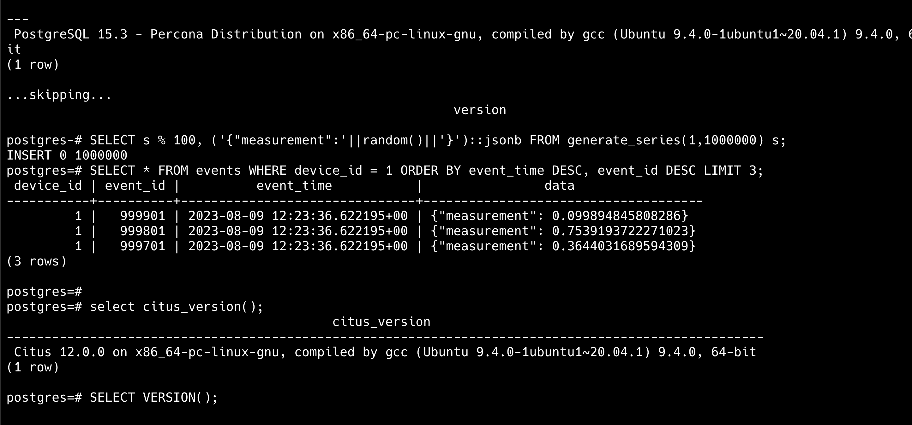

# Percona Distribution PostgreSQL 15

```bash
wget https://repo.percona.com/apt/percona-release_latest.$(lsb_release -sc)_all.deb
sudo dpkg -i percona-release_latest.$(lsb_release -sc)_all.deb
sudo apt update
sudo percona-release setup ppg-15
sudo apt install percona-ppg-server-15
sudo systemctl status postgresql.service
sudo su postgres
psql
SELECT VERSION();
```

# Install Citus 12

```bash
curl https://install.citusdata.com/community/deb.sh > add-citus-repo.sh
sudo bash add-citus-repo.sh
sudo apt-get -y install postgresql-15-citus-12.0
```

# Citus configuration

```bash
# To add Citus to your local PostgreSQL database, add the following to postgresql.conf:
/etc/postgresql/15/main  -> postgresql.conf
shared_preload_libraries = 'citus'
```

# Restart Postgres

```bash
sudo systemctl status postgresql
sudo su postgres
psql
```

# After restarting PostgreSQL, connect using psql and create the extension:

```sql
CREATE EXTENSION citus;
-- Checking Citus version
select citus_version();
```

# Testing

```sql
-- Create basic table
CREATE TABLE events (
device_id bigint,
event_id bigserial,
event_time timestamptz default now(),
data jsonb not null,
PRIMARY KEY (device_id, event_id)
);
```

# Create the distribuited table in "events"

```sql
-- distribute the events table across shards placed locally or on the worker nodes
SELECT create_distributed_table('events', 'device_id');
-- insert some events
INSERT INTO events (device_id, data)
SELECT s % 100, ('{"measurement":'||random()||'}')::jsonb FROM generate_series(1,1000000) s;
-- get the last 3 events for device 1, routed to a single node
SELECT \* FROM events WHERE device_id = 1 ORDER BY event_time DESC, event_id DESC LIMIT 3;
```

# results

 <p align="center">
    
</p>
